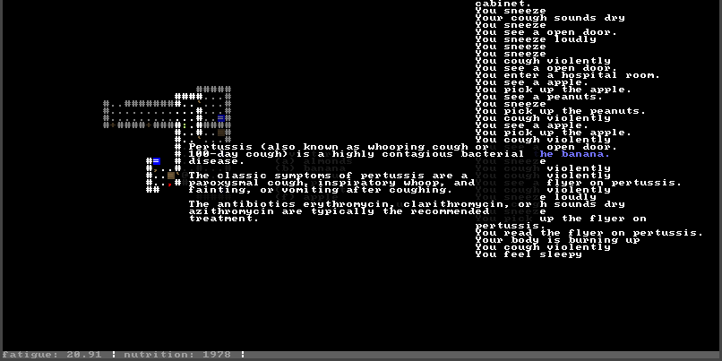

Created for the 2017 7DRL Challenge

Written by Srinivas Kaza and Matthew Pfeiffer

Uses libtcod 1.5.1 © Jice & Mingos
http://doryen.eptalys.net/libtcod



#ABOUT

You wake up in an empty hospital infected with some fatal disease, and must
search for how to cure yourself.

Have fun!

#TO RUN

    Windows users can download the windows build and run MedicalRL.exe.

    Linux users can install Python 3 if they don't have it and run python3
    main.py. (Will need libtcod library files, though they are included in the
    Linux download).

#HOW TO PLAY

Movement is done with the number pad, vi style keys, or arrow keys.

```
7 8 9    y k u
 \|/      \|/
4-5-6    h-.-l
 /|\      /|\
1 2 3    b j n
```

Inventory is 'i'. Walk into objects or select them from your inventory to use
them. Menus all use a-z for options.

#The window is too small!

To scale everything up, you may replace the terminal.png file with one of the
terminal_scaled_*.png files.
